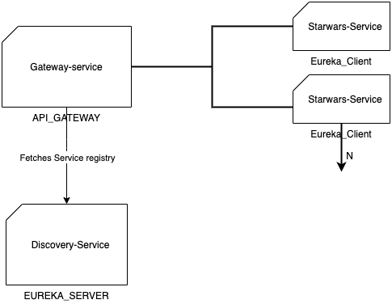

# Microservice for Starwars

In this project I have implemented Microservices which are
1. discovery-service
2. gateway-service
3. starwars-service

## Discovery-service

Discovery-service is a eureka-server which will register all the eureka clients. 
**Endpoint:** http://localost:8761  
**DockerImage:** [Discovery-service](https://hub.docker.com/layers/152851117/sridhar2193/discovery-service/1.0/images/sha256-7ab171aaafff091b540042916b67faf3d4ecd3bf30bbe116f8e4d116e3fc2084?context=explore)

## Gateway-service

Gateway-service uses netflix zuul which acts as a gateway for eureka clients services. Gateway-service itself is eureka-client.
This also routes the request to corresponding microservice. In our case it is starwars-service. 
**Endpoint:** http://localost:8765  
**DockerImage:** [Gateway-service](https://hub.docker.com/layers/152851193/sridhar2193/gateway-service/1.0/images/sha256-3b8df98cfcf1ebc4acb58ccce1a6910d4702516ba5258e6df17b69637234a4ee?context=explore)

## Starwars-service

Starwars-service will fetch starwars details with pre-created data by [schema.sql](starwars-service/src/main/resources/schema.sql) and [data.sql](starwars-service/src/main/resources/data.sql).
Please refer data.sql for data to query. Unit Tests written for controller and service files. 
**Endpoint:** http://localhost:8081/starwars/api/{type} or http://localhost:8765/starwars/api/{type}  
**DockerImage:** [StarWars-service](https://hub.docker.com/layers/152851253/sridhar2193/starwars-service/1.0/images/sha256-84998be0816edaa66c328952b35560e5c8066e6374e068e8f0f0b937e63da5aa?context=explore)

### Usage

1. Exposes REST endpoints using RestController and GetMapping. For more information see **SWAGGER** section.
2. Uses h2 in-memory database.
3. CrudRepository being uses to fetch data from database.
4. OpenAPI and swagger support added.

### Functional Description

Starwars-service is a microservice used to fetch starwars details by providing type and/or name. 
Api will return TYPE,COUNT and NAME. 
API which Return Starwars Data also included.

## Swagger

Swagger can be accessed via two ways.
1. http://localhost:8081/swagger-ui.html
2. http://localhost:8765/swagger-ui.html

## Design patterns

1. Singleton pattern used via auto-wiring beans
2. Service-Discovery pattern used via Eureka server and client
3. API-Gateway pattern used via zuul

## Docker
1. Dockerfile individually written for discovery-service, gateway-service and starwars-service. 
2. [docker-compose](docker-compose.yml) file is written to deploy all the service at the same time.

## Jenkins
Jenkinsfile will trigger the build for starwars-microservice project. 
Jenkinsfile uses declarative pipeline.

## Achitecture Diagram

Below is a diagram drawn using drawio and exported as image

